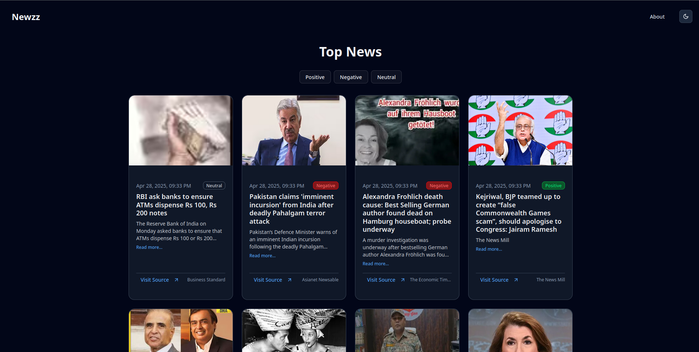
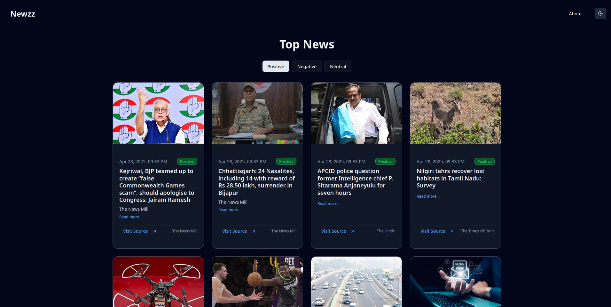

# 📰 Newzz – AI-Powered News App

Welcome to **Newzz**, an AI-powered news platform that provides sentiment-based insights, user feedback for model improvement, and smart filtering — all wrapped in a clean, modern interface.

---

## 🚀 Version 1.0 – Highlights

✅ **Sentiment Analysis Integrated**  
✅ **Live News Fetching with Sentiment Tags**  
✅ **Filter News by Sentiment: Positive | Negative | Neutral**  
✅ **Public Feedback System on Sentiment Accuracy**  
✅ **Feedback Used for Retraining the Sentiment Model**

Whether you're scanning headlines or diving deep into full articles, Newzz helps you consume news with **context-aware sentiments**.

---

### Table of contents

- [Description](#description)
- [Tech Stack Overview](#️-tech-stack-overview)
- [Screenshots](#-screenshots)
- [Installation](#-installation-instructions)
  - [Backend](#backend-installation)
  - [Frontend](#frontend-installation)
- [Future Scope](#-future-scope)
- [Contributions](#contributions)

---

## Description

### 🧠 Powered by AI: Sentiment Analysis Using DistilBERT

At the core of the application lies a **fine-tuned `DistilBERT` model** (from Hugging Face Transformers) that processes news headlines and classifies them as:

- ✅ **Positive**
- ⚠️ **Neutral**
- ❌ **Negative**

This allows readers to quickly gauge the emotional tone of the news they consume — an essential tool in the age of information overload and emotionally charged media.

For more details visit [model_train](./model_train/readme.md).

---

### 🔄 Workflow and Functionality

1. **Hourly News Ingestion**  
   The backend initiates a scheduled job (every hour) to fetch fresh news headlines using the [NewsData.io](https://newsdata.io/) API.

2. **Sentiment Classification**  
   Each fetched article is passed through the **DistilBERT model**, which labels its sentiment as Positive, Negative, or Neutral.

3. **Database Storage**  
   All news articles along with their classified sentiments are stored in **MongoDB** for quick access.

4. **Frontend Rendering**  
   When users visit the app, the frontend fetches classified news from MongoDB via API calls and displays them with **sentiment-based filters**.

5. **User Feedback for Retraining**  
   Users can submit feedback if they believe the sentiment classification is inaccurate. These feedback entries are stored in the database and will be used later to **retrain the model**, improving its robustness and personalization.

---

### ⚙️ Tech Stack Overview

#### 🌐 **Frontend**

- **ReactJS** – Component-based architecture for dynamic UI
- **ShadCN UI** – Elegant, accessible UI components built on top of Radix UI and Tailwind
- **Tailwind CSS** – Utility-first styling for consistent and responsive design
- **Redux Toolkit** – Scalable and maintainable state management

#### 🧪 **Backend**

- **Flask** – Lightweight Python web framework to serve API endpoints
- **MongoDB** – NoSQL database to store news articles, user feedback, and classification data
- **PyTorch + Transformers** – Runs the DistilBERT model for real-time classification
- **NewsData.io API** – External API source to fetch live news headlines globally

---

## 📸 Screenshots





## 🔧 Installation Instructions

### Backend Installation

1. Navigate to the **backend** folder:

   ```bash
   cd backend
   ```

2. Create a virtual environment:

   - For **Windows**:

     ```bash
     python -m venv venv
     ```

   - For **macOS/Linux**:
     ```bash
     python3 -m venv venv
     ```

3. Activate the virtual environment:

   - For **Windows**:

     ```bash
     venv\Scripts\activate
     ```

   - For **macOS/Linux**:
     ```bash
     source venv/bin/activate
     ```

4. Install the required dependencies from `requirements.txt`:

   ```bash
   pip install -r requirements.txt
   ```

5. Create a `.env` file in the **backend** folder and add the following contents:

   ```env
   APP_SECRET_KEY=5cede5c77a16b05af8abbc53518808e0fbf37ddee3de94f7717f7c96c150d342
   MONGO_URI=<MONGO_URI>
   NEWS_API_KEY=<NEWS_API_KEY>
   ```

   - Replace `<MONGO_URI>` with your MongoDB URI.
   - Replace `<NEWS_API_KEY>` with your News API key. (Use the API key from [News Data](https://newsdata.io/) only)

6. **Download the Sentimental Model**:

   - Download all files from the **Sentimental Model** folder from the provided [Google Drive link](https://drive.google.com/drive/folders/1spIQpuRltzJNp7nld6Hm3vSmCP6qd3fv?usp=sharing).
   - Save all the files in the following path: `backend/model/sentimental_model/` (If path doesn't exist create the path).

7. Run the server:
   ```bash
   python run.py
   ```

The backend server will start at `http://localhost:5000`.

---

### Frontend Installation

1. Navigate to the `frontend` folder:

   ```bash
   cd frontend
   ```

2. Install the required dependencies:

   ```bash
   npm install
   ```

3. Run the development server:

   ```bash
   npm run dev
   ```

Your app will be live at `http://localhost:5173` for development. Go to this address to see the app.

### 🧭 Future Roadmap

Our mission is to evolve Newzz into a fully personalized and trusted AI news platform. Planned features include:

- 🔐 **User Authentication** – Enable personalized experiences and verified feedback
- 🎯 **AI-Based News Recommendation System** – Tailored news delivery based on reading preferences and sentiment interaction
- 🗃️ **News Topic Filtering** – Filter news based on specific topics like Politics, Tech, Sports, etc.
- 🤖 **AI News Summarization** – Summarize articles using LLMs for quick reads
- 🚫 **Fake News Detection** – Identify potentially fake or misleading news using advanced NLP techniques
- 🌍 **More News Sources** – Integrate additional APIs to bypass the limitations of a single provider and ensure broad coverage
- 🎨 **UI/UX Improvements** – Enhance the visual design, responsiveness, and accessibility across devices

---

### Contributions

- [Sadgi Sharma](https://github.com/Sadgi-Sharma) : Have researched and trained model for this project.
- [Vrashesh Ganjre](https://github.com/vrasheshganjre) : Built the frontend and backend of the application.
- [Sudhanshu Wankhede](https://github.com/Sudhanshu2604) : Researched and helped to built the frontend of the application.

---
