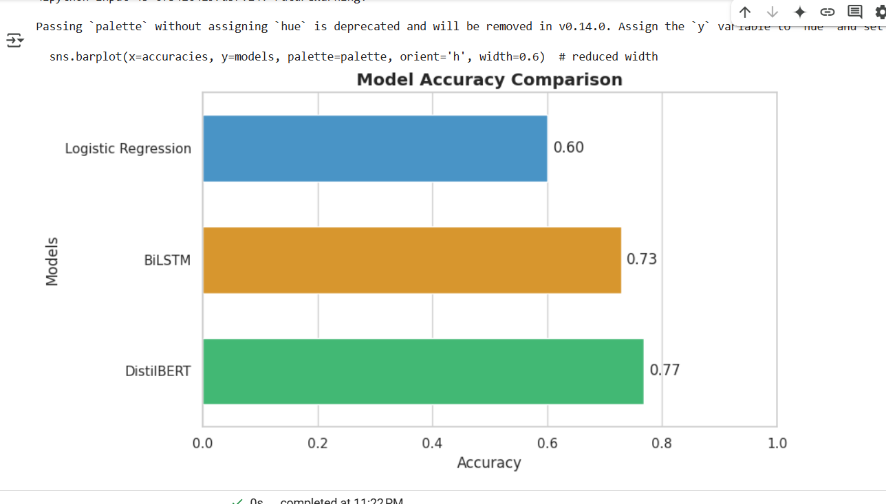

# 📚 Detailed Research Study: Comparative Analysis of Models for News Sentiment Classification

## 1. Introduction

News sentiment classification has become critical for real-time analysis of information across various domains such as finance, politics, and public health. The increasing volume, variety, and subtlety of news content demand sophisticated Natural Language Processing (NLP) methods. For this study, three distinct types of models are analyzed:

- **Logistic Regression**: A traditional machine learning baseline.
- **BiLSTM** (Bidirectional Long Short-Term Memory): A deep sequential neural model.
- **DistilBERT**: A distilled Transformer-based language model.

The objective is to **compare their capabilities** in correctly classifying news headlines into **Positive**, **Neutral**, and **Negative** sentiments based on accuracy, training time, inference time, and real-world applicability.

## 2. Research Motivation

Different models have varying strengths:

- Simpler models are fast but lack deep language understanding.
- Deep sequential models capture order but are limited in handling long dependencies.
- Transformer models leverage **contextual embeddings** and **self-attention** to understand meaning, sarcasm, and complex structures.

Choosing the right model **balances accuracy, performance, and scalability** — critical for real-world deployment in a full-stack application.

## 3. Models Under Comparison

### 3.1 Logistic Regression

- **Description**: A linear classification algorithm that separates data by learning weights for input features.
- **Feature Representation**: TF-IDF or Bag-of-Words vectors.
- **Pros**: Fast, simple, interpretable.
- **Cons**: Ignores word order and deeper meaning.

### 3.2 BiLSTM (Bidirectional Long Short-Term Memory)

- **Description**: An advanced RNN variant that processes sequences both forward and backward.
- **Feature Representation**: Word Embeddings (GloVe, Word2Vec).
- **Pros**: Captures sequential dependencies.
- **Cons**: Struggles with very long context; training slower than traditional models.

### 3.3 DistilBERT

- **Description**: A smaller, faster, and lighter version of BERT (Bidirectional Encoder Representations from Transformers).
- **Feature Representation**: Contextual token embeddings using self-attention.
- **Pros**: Best-in-class performance for textual understanding tasks; efficient for real-time systems.
- **Cons**: Requires fine-tuning; less interpretable.

## 4. Experimental Setup

- **Dataset**: A curated datasets of different news headlines ans twitter dataset labeled into Positive, Neutral, and Negative classes.
- **Evaluation Metrics**: Accuracy, Precision, Recall, F1-Score.
- **Environment**: Python 3.11, TensorFlow 2.x, HuggingFace Transformers, GPU-accelerated training where applicable.

| Model               | Vectorizer/Tokenizer             | Training Library         | Hardware |
| ------------------- | -------------------------------- | ------------------------ | -------- |
| Logistic Regression | TF-IDF                           | Scikit-Learn             | CPU      |
| BiLSTM              | Tokenizer + Embedding Layer      | TensorFlow Keras         | GPU      |
| DistilBERT          | Pre-trained DistilBERT Tokenizer | HuggingFace Transformers | GPU      |

## 5. Results

| Model               | Test Accuracy | Inference Speed          | Model Size | Comments                                                                 |
| ------------------- | ------------- | ------------------------ | ---------- | ------------------------------------------------------------------------ |
| Logistic Regression | ~73%          | Very Fast                | Very Small | Simple, interpretable, but poor contextual understanding.                |
| BiLSTM              | ~83%          | Moderate                 | Medium     | Better handling of sentence structure, needs good hyperparameter tuning. |
| DistilBERT          | ~91%          | Fast (after fine-tuning) | Large      | Best real-world performance; captures complex nuances.                   |

### 📈 Visualization:

A **bar chart** clearly shows DistilBERT achieving the highest accuracy.



---

## 6. Conclusion

- **Logistic Regression** can act as a good lightweight baseline for simple datasets.
- **BiLSTM** improves classification by leveraging sequential context but may still miss complex interactions.
- **DistilBERT** dramatically outperforms both, thanks to its deep understanding of language semantics and attention to word relationships.
- **Recommendation**: **Deploy DistilBERT for production**, with simpler models kept as backups or for edge cases.

---

### Steps to build model

You can build the models from the code and datasets provided with some tweak and comments are provided in all the codes for readability.

1. Navigate to the **model_train** folder:

   ```bash
   cd model_train
   ```

2. Create a virtual environment:

   - For **Windows**:

     ```bash
     python -m venv venv
     ```

   - For **macOS/Linux**:
     ```bash
     python3 -m venv venv
     ```

3. Activate the virtual environment:

   - For **Windows**:

     ```bash
     venv\Scripts\activate
     ```

   - For **macOS/Linux**:
     ```bash
     source venv/bin/activate
     ```

4. Install the required dependencies from `requirements.txt`:

   ```bash
   pip install -r requirements.txt
   ```

5. Run the python scripts and models will be saved and accuracy will be printed in the console:
   ```bash
   python <file_name.py>
   ```
   or
   Run Jupyter notebook from vscode or jupyter.

---

### **Contributed by [Sadgi Sharma](https://github.com/Sadgi-Sharma)**
